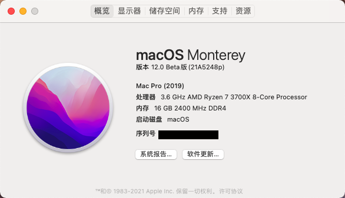

#  Hackintosh-Opencore-MAG-MSI--B550M-MORTAR-WIFI

微星(MSI)MAG B550M MORTAR WIFI迫击炮

### OpenCore 版本 : 0.7.1正式版

### MacOS 版本 ：12.0 Beta版(21A5248p)

### SMBIOS : MacPro7,1

## Specification

| **Component**    | **Model**                                                    |
| ---------------- | ------------------------------------------------------------ |
| CPU              | AMD 锐龙7 3700X                                              |
| Motherboard      | 微星(MSI)MAG B550M MORTAR WIFI                               |
| RAM              | 金士顿 (Kingston) 16GB DDR4 2400                             |
| Audio Chipset    | ALC 1200                                                     |
| GPU              | 讯景（XFX）RX 590 8G 黑狼版(已刷Sapphire vbios *根据自身颗粒进行选择*) |
| Ethernet         | RTL8125B 2.5GbE                                              |
| WiFi & Bluetooth | Intel WiFi 6 AX200                                           |
| OS Disk(nvme)    | kioxia/铠侠固态硬盘1t RC10                                   |

## What works

- Audio (`alcid=11`)
- Ethernet（[LucyRTL8125Ethernet](https://github.com/Mieze/LucyRTL8125Ethernet)）

- USB
- Wi-Fi（[itlwm](https://github.com/OpenIntelWireless/itlwm)）
- Bluetooth（[IntelBluetoothFirmware](https://github.com/OpenIntelWireless/IntelBluetoothFirmware)）[macOS Monterey additional steps](https://openintelwireless.github.io/IntelBluetoothFirmware/FAQ.html#what-additional-steps-should-i-do-to-make-bluetooth-work-on-macos-monterey)

使用`RestrictEvents.kext`修改处理器显示型号

-   `revcpu=value`启用（`1`，非Intel默认值）/禁用（`0`，Intel默认值）更多请参考[RestrictEvents](https://github.com/acidanthera/RestrictEvents)

    

PS：使用时请使用[OpenCore Configurator](https://mackie100projects.altervista.org/opencore-configurator/) 、 [OC Auxiliary](https://github.com/ic005k/QtOpenCoreConfig)、[GenSMBIOS](https://github.com/corpnewt/GenSMBIOS)等工具重新生成三码