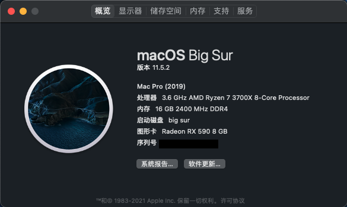

#  Hackintosh-Opencore-MAG-MSI--B550M-MORTAR-WIFI

微星(MSI)MAG B550M MORTAR WIFI迫击炮

### OpenCore : 0.7.2 正式版

### macOS ：11.5.2 正式版

### SMBIOS : MacPro7,1

## Specification

| **Component**    | **Model**                                 |
| ---------------- | ----------------------------------------- |
| CPU              | AMD R7 3700X                              |
| Motherboard      | MSI(MAG) B550M MORTAR WIFI                |
| RAM              | Kingston 16GB DDR4 2400                   |
| Audio Chipset    | ALCS1200A                                 |
| GPU              | XFX RX 590 8G 黑狼版 (已刷Sapphire vbios) |
| Ethernet         | RTL8125B 2.5GbE                           |
| WiFi & Bluetooth | Intel WiFi 6 AX200                        |
| OS Disk(nvme)    | kioxia RC10 1TB                           |

## What works

- Audio (`alcid=11`)
- Ethernet（[LucyRTL8125Ethernet](https://github.com/Mieze/LucyRTL8125Ethernet)）

- USB
- Wi-Fi（[itlwm](https://github.com/OpenIntelWireless/itlwm)）
- Bluetooth（[IntelBluetoothFirmware](https://github.com/OpenIntelWireless/IntelBluetoothFirmware)）[macOS Monterey additional steps](https://openintelwireless.github.io/IntelBluetoothFirmware/FAQ.html#what-additional-steps-should-i-do-to-make-bluetooth-work-on-macos-monterey)

###  使用`RestrictEvents.kext`修改处理器显示型号

-   `revcpu=value`启用（`1`，非Intel默认值）/禁用（`0`，Intel默认值）更多请参考[RestrictEvents](https://github.com/acidanthera/RestrictEvents)

### NEW AMD Kernel Patches

1.  Enable `ProvideCurrentCpuInfo`(Kernel -> Quirks )
2.  Edit the core count patch to match your CPU [read AMD Vanilla OpenCore](https://github.com/AMD-OSX/AMD_Vanilla/tree/master)

PS：使用时请使用[OpenCore Configurator](https://mackie100projects.altervista.org/opencore-configurator/) 、 [OC Auxiliary](https://github.com/ic005k/QtOpenCoreConfig)、[GenSMBIOS](https://github.com/corpnewt/GenSMBIOS)等工具重新生成三码

>   要启动Monterey beta3及以上版本，请将[MSI BIOS](https://cn.msi.com/Motherboard/support/MAG-B550M-MORTAR-WIFI#down-bios)版本降至`7C94v12`
>
>   由于bios版本降低到1.2及以下后会导致windows无法正常使用WIFI和网卡，本EFI回归至Big Sur，等待后续更新。