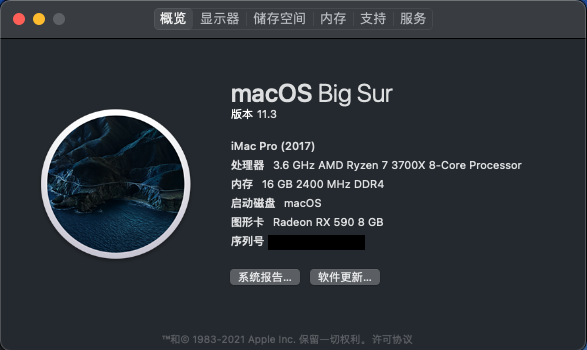
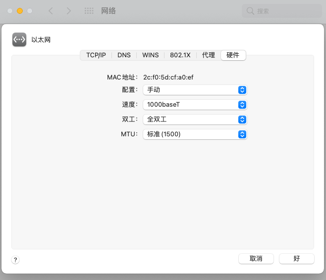

#  Hackintosh-Opencore-MAG-MSI--B550M-MORTAR-WIFI

微星(MSI)MAG B550M MORTAR WIFI迫击炮

### OpenCore 版本 : 0.6.8正式版

### MacOS 版本 ：11.3 Beta

### SMBIOS : iMacPro1,1

## Specification

| **Component**    | **Model**                                         |
| ---------------- | ------------------------------------------------- |
| CPU              | AMD 锐龙7 3700X                                   |
| Motherboard      | 微星(MSI)MAG B550M MORTAR WIFI                    |
| RAM              | 金士顿 (Kingston) 16GB DDR4 2400                  |
| Audio Chipset    | ALC 1200                                          |
| GPU              | 讯景（XFX）RX 590 8G 黑狼版(已刷Powercolor vbios) |
| Ethernet         | RTL8125B 2.5GbE                                   |
| WiFi & Bluetooth | Intel WiFi 6 AX200                                |
| OS Disk(nvme)    | kioxia/铠侠固态硬盘1t RC10                        |

## What works

- Audio (`alcid=11`)
- Ethernet

- USB
- Wi-Fi
- Bluetooth

使用`RestrictEvents.kext`修改处理器显示型号

-   `revcpu=value`启用（`1`，非Intel默认值）/禁用（`0`，Intel默认值）更多请参考[RestrictEvents](https://github.com/acidanthera/RestrictEvents)

    

PS：使用时请使用OpenCore Configurator 、 OC Auxiliary等工具重新生成三码