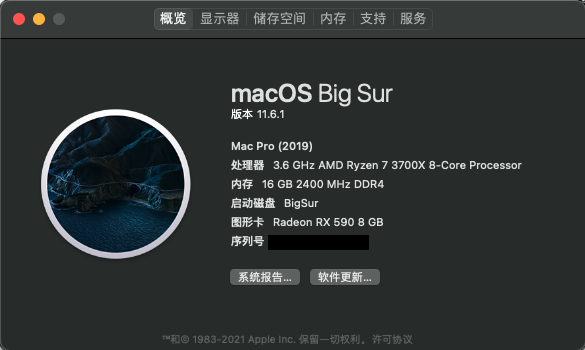

#  Hackintosh-Opencore-MAG-MSI--B550M-MORTAR-WIFI

微星(MSI)MAG B550M MORTAR WIFI迫击炮



**OpenCore : 0.7.5**

**macOS ：11.6.2**

**SMBIOS : MacPro7,1**

### Specification

| **Component**    | **Model**                  |
| ---------------- | -------------------------- |
| CPU              | AMD R7 3700X               |
| Motherboard      | MSI(MAG) B550M MORTAR WIFI |
| RAM              | Kingston 16GB DDR4 2400    |
| Audio Chipset    | ALCS1200A                  |
| GPU              | XFX RX 590 8G              |
| Ethernet         | RTL8125B 2.5GbE            |
| WiFi & Bluetooth | Intel WiFi 6 AX200         |
| OS Disk(nvme)    | kioxia RC10 1TB            |

### What works

- Audio

    [AppleALC](https://github.com/acidanthera/AppleALC) (`alcid=11`)

- Ethernet

    [LucyRTL8125Ethernet](https://github.com/Mieze/LucyRTL8125Ethernet)

- USB

- Wi-Fi

    [itlwm](https://github.com/OpenIntelWireless/itlwm)

- Bluetooth

    [IntelBluetoothFirmware](https://github.com/OpenIntelWireless/IntelBluetoothFirmware) 

    [macOS Monterey additional steps](https://openintelwireless.github.io/IntelBluetoothFirmware/FAQ.html#what-additional-steps-should-i-do-to-make-bluetooth-work-on-macos-monterey)

### NEW AMD Kernel Patches

1.  Enable `ProvideCurrentCpuInfo`

    `Kernel -> Quirks -> ProvideCurrentCpuInfo`

2.  Edit the core count patch to match your CPU

    [read AMD Vanilla OpenCore](https://github.com/AMD-OSX/AMD_Vanilla/tree/master)

    >   Find the three `algrey - Force cpuid_cores_per_package` 
    >
    >   `kernel -> Patch -> 0  -> Replace` for macOS 10.13,10.14
    >
    >   `kernel -> Patch -> 1  -> Replace` for macOS 10.15,11.0
    >
    >   `kernel -> Patch -> 2  -> Replace` for macOS 12.0
    >
    >   Replace:
    >
    >   ```
    >   B8000000 0000
    >   BA000000 0000
    >   BA000000 0090
    >   ```
    >
    >   Becomes:
    >
    >   ```
    >   B8 <CoreCount> 0000 0000
    >   BA <CoreCount> 0000 0000
    >   BA <CoreCount> 0000 0090
    >   ```
    >
    >   | CoreCount | Hexadecimal |
    >   | --------- | ----------- |
    >   | 6 Core    | 06          |
    >   | 8 Core    | 08          |
    >   | 12 Core   | 0C          |
    >   | 16 Core   | 10          |
    >   | 32 Core   | 20          |
    >
    >
    >   So for example a 6 Core 3700X Replace value would result in these replace values
    >
    >   Replace:
    >
    >   ```
    >   B8 08 0000 0000
    >   BA 08 0000 0000
    >   BA 08 0000 0090
    >   ```
    >
    >   Note the `08`  for the 8 Core CPU

please use [OpenCore Configurator](https://mackie100projects.altervista.org/opencore-configurator/) or  [OC Auxiliary](https://github.com/ic005k/QtOpenCoreConfig)  or  [GenSMBIOS](https://github.com/corpnewt/GenSMBIOS)  to generate yourself SMBIOS

### Monterey

>   要启动Monterey beta3及以上版本，请将[MSI BIOS](https://cn.msi.com/Motherboard/support/MAG-B550M-MORTAR-WIFI#down-bios)版本降至`7C94v12`
>
>   由于bios降低到1.2及以下后会导致windows无法正常使用WIFI和网卡，EFI回到Big Sur。