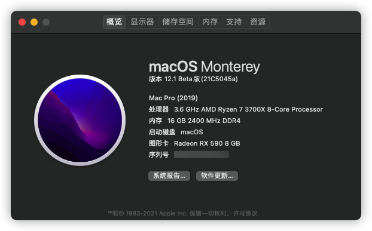
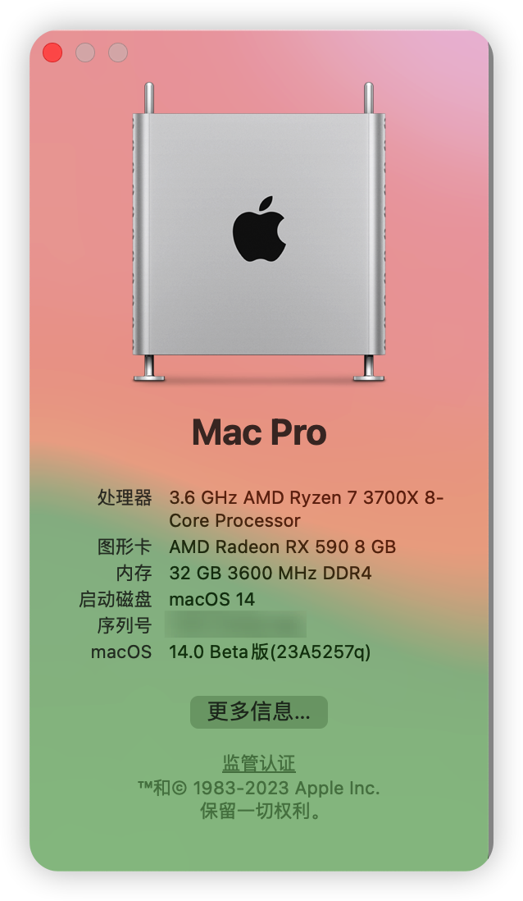

# Hackintosh-Opencore-MAG-MSI--B550M-MORTAR-WIFI

微星(MSI)MAG B550M MORTAR WIFI迫击炮



**OpenCore : 0.9.2**

**macOS ：13.4**

**SMBIOS : MacPro7,1**

### Specification

| **Component**    | **Model**                  |
| ---------------- | -------------------------- |
| CPU              | AMD R7 3700X               |
| Motherboard      | MSI(MAG) B550M MORTAR WIFI |
| RAM              | Kingston 16GB DDR4 2400    |
| Audio Chipset    | ALCS1200A                  |
| GPU              | XFX RX 590 8G              |
| Ethernet         | RTL8125B 2.5GbE            |
| WiFi & Bluetooth | Intel WiFi 6 AX200         |
| OS Disk(nvme)    | kioxia RC10 1TB            |

### What works

- Audio
  
  [AppleALC](https://github.com/acidanthera/AppleALC) ( `alcid=11 `)

- Ethernet
  
  [LucyRTL8125Ethernet](https://github.com/Mieze/LucyRTL8125Ethernet)

- USB
  
  [USBToolBox](https://github.com/USBToolBox/toolhttps://github.com/USBToolBox/tool) (Include `USBToolBox.kext` and `UTBMap.kext`)
  
  If you have USB problems, You can use it to generate your own usb configuration information

- Wi-Fi
  
  [itlwm](https://github.com/OpenIntelWireless/itlwm)

- Bluetooth
  
  [IntelBluetoothFirmware](https://github.com/OpenIntelWireless/IntelBluetoothFirmware)
  
  IntelBluetoothInjector.kext set the `MaxKernel` field to `20.99.9` (BigSur)
  
  [BlueToolFixup.kext](https://github.com/acidanthera/BrcmPatchRAM) and [IntelBTPatcher.kext](https://github.com/OpenIntelWireless/IntelBluetoothFirmware) set the `MinKernel` field to `21.00.0` (Monterey)

### NEW AMD Kernel Patches

1. Enable `ProvideCurrentCpuInfo`
   
   `Kernel -> Quirks -> ProvideCurrentCpuInfo`

2. Edit the core count patch to match your CPU
   
   [AMD Vanilla OpenCore](https://github.com/AMD-OSX/AMD_Vanilla/tree/master) or [OpenCore-Install-Guide](https://dortania.github.io/OpenCore-Install-Guide/extras/monterey.html#amd-patches)
   
   > Find the three `algrey - Force cpuid_cores_per_package`
   > 
   > - `kernel -> Patch -> 0  -> Replace` for macOS 10.13,10.14
   > 
   > - `kernel -> Patch -> 1  -> Replace` for macOS 10.15,11.0
   > 
   > - `kernel -> Patch -> 2  -> Replace` for macOS 12.0
   > 
   > ```
   > B8000000 0000 => B8 <core count> 0000 0000
   > BA000000 0000 => BA <core count> 0000 0000
   > BA000000 0090 => BA <core count> 0000 0090
   > ```
   > 
   > | CoreCount | Hexadecimal |
   > | --------- | ----------- |
   > | 6 Core    | 06          |
   > | 8 Core    | 08          |
   > | 12 Core   | 0C          |
   > | 16 Core   | 10          |
   > | 32 Core   | 20          |
   > | 64 Core   | 40          |
   > 
   > for eamlple : 3700X 8 Core
   > 
   > ```
   > B8 08 0000 0000
   > BA 08 0000 0000
   > BA 08 0000 0090
   > ```

please use [OpenCore Configurator](https://mackie100projects.altervista.org/opencore-configurator/) or  [OC Auxiliary](https://github.com/ic005k/QtOpenCoreConfig)  or  [GenSMBIOS](https://github.com/corpnewt/GenSMBIOS)  to generate yourself SMBIOS

### Monterey

Most MSI B550 motherboard need use the 7C94v12 version of the bios to start Monterey. Please test yourself according to your hardware.

### Ventura

Now you can skip **Monterey** and upgrade to **Ventura**

it works for me

### Sonoma

You need to disable `NVMeFix.kext` to start **Sonoma**



**Be careful that some kext do not work**

### BIOS

My bios version is **[7C94v1F](https://download.msi.com/bos_exe/mb/7C94v1F.zip)**. You can download bios [here](https://www.msicn.com.cn/Motherboard/MAG-B550M-MORTAR-WIFI/support#bios)

[AMD BIOS Settings](https://dortania.github.io/OpenCore-Install-Guide/AMD/zen.html#amd-bios-settings)

I use `npci=0x3000` instead of enable **above 4G**
